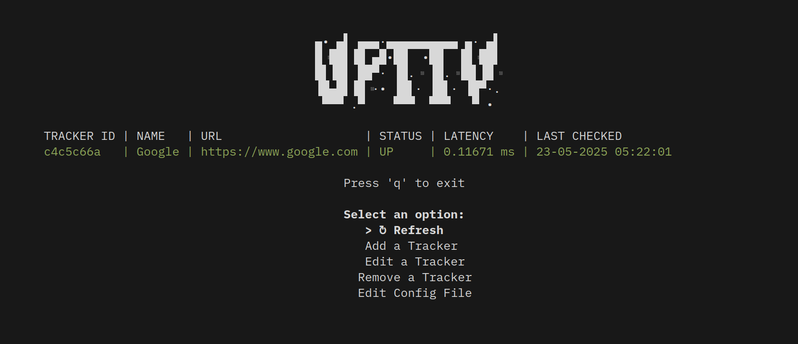

<p align="center">
    

</p>


UpTTY *(uptime + tty)* is a CLI/TUI tool to moniter remote services and get notified when they go down.





# Installation  

Run the following command to install both UpTTY and UpTTY-TUI

```bash
curl -fsSL https://raw.githubusercontent.com/TanmayArya-1p/Assignment-2025/refs/heads/tcan/uptty/install.sh | sudo bash
```

# Configuration

By default the config is stored at `$HOME/.local/share/upt/.uptrc`. To edit the config run

```bash
uptty config
```

The configuration file `uptrc` currently only has 4 options:

### UPT_CSV
Location of the CSV file used for storing Trackers. By default its value is `~/.local/share/uptty/uptime.csv`

### UPT_CRONJOB
`true` or `false` — determines whether the ping cronjob should be enabled.

### UPT_CRONJOB_INTERVAL
An integer value between **1** and **59** (inclusive). This sets the interval in minutes between each execution of the cronjob.

### UPT_TEXT_EDITOR

Text editor to use for modifying/adding trackers in the TUI. Default value is `nano`


#### An example .uptrc looks like this:
```bash
UPT_CSV="/home/tanmay/.local/share/upt/uptime.csv"
UPT_CRONJOB="true"
UPT_CRONJOB_INTERVAL=1
UPT_TEXT_EDITOR="nano"
```


<br></br>
# Commands

### `uptty`

Start UpTTY in TUI mode.

### `uptty ls` / `uptty list`

List monitered sites and their status.

### `uptty help` / `uptty --help` / `uptty -h` 

Show the help message.

### `uptty config`

Edit the config file (~/.local/share/upt/.uptrc) using the editor configured in `.uptrc` .

### `uptty add <name> <url>`

Add a new tracker with a `name` and `url` of your choice.

### `uptty remove <name/uuid>` / `uptty rm <name/uuid>`

Each tracker has a UUID that is used to identify it. You can check the UUID of a tracker either using `uptty ls` or `uptty desc <name>` .

Using the above command you can delete a tracker.


### `uptty desc <name/uuid>`

See a more verbose description of a tracker.

### `uptty check` / `uptty ls`

Ping all the trackers and update their latency/status.

### `uptty edit <name/uuid> -u <new_url> -n <new_name>`

Edit the `name` or `url` of an existing tracker using the above command.

### `uptty cron`

See the status and logs of an existing cronjob.

### `uptty add-cron`

If you havent setup a cronjob or have disabled it in `.uptrc`, then running this command will set it up for you.


> **Note:**  
> You can modify the interval between each cronjob run in the `.uptrc` by changing `UPT_CRONJOB_INTERVAL` .

### `uptty remove-cron`

Remove all existing cronjobs for `uptty` .

### `uptty reload`

Reload the config (`.uptrc`).


